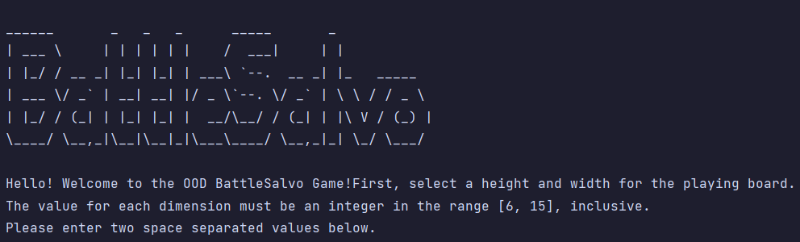
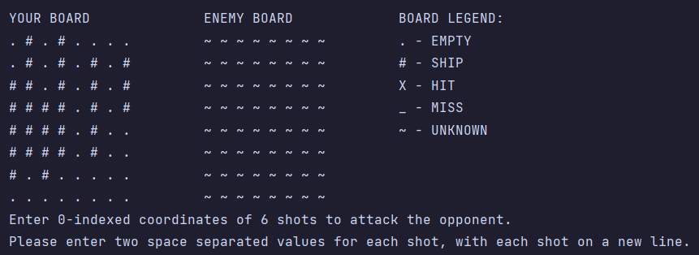
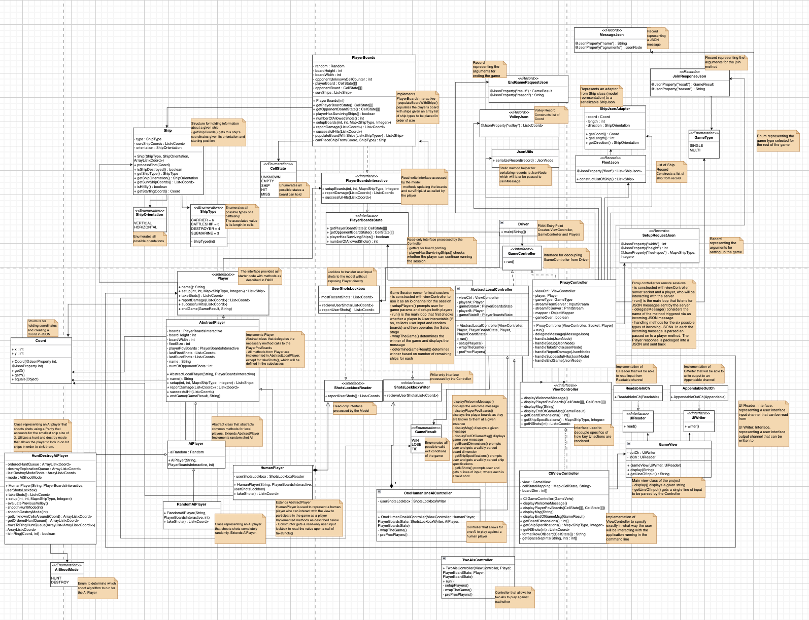

# CLI Battle Salvo

### Version 1.1

This is a polished version of a two-part programming assignment for CS3500 Object Oriented Design, as
described in the [PA04 Write-Up](https://markefontenot.notion.site/PA-04-BattleSalvo-Part-2-20ff66267da84956b35794bf8452c2fd)
here.

This is a CLI program that allows the user to play a game of Battle Salvo. In this game, the user gets to
select a size of the field (between 6 and 14 in each dimension) and fleet specifications (how many ships
of each type the players will have) before the beginning of the round. Unlike classic Battleship, in BattleSalvo
both opponents shoot at the same time, and as many shots as they have ships surviving. Shots are exchanged 
until one or both opponents are out of ships, meaning that games can result in a draw.

As a part of this assignment, HuntDestroyAI was developed to compete in a class-wide tournament. It is an
algorithm, inspired by classic Battleship approach of first "hunting" in a checkerboard
pattern for any hit, and then committing to "destroy" the found ship. HuntDestroyAI can be run against 
a random shooter to see its effectiveness.

### Game Configuration
The game can be configured through command line arguments to be played human vs machine
(Random or HuntDestroyAI), machine vs machine (Random vs HuntDestroyAI) and
machine vs server (both local and remote). Local server is provided as a [.jar](Server.jar) 
and runs instructor-written Random algorithm. 

*Note: If you want to run machine vs server, the local server must be run before running the program*

Expected command line argument format for each of the game modes:
- `humanVsAi [random|huntDestroy]`
- `aiVsRandom`
- `aiVsServer [random|huntDestroy] [local|<Host IP address> <Host port>]`

### Contributors
[ryankhada](https://github.com/ryankhada) worked on the design of HuntDestroyAI and JSON processing for remote play.

### UML
 